# Pipeline & Automation Implementation Guide

## Objective
Orchestrate ingestion, preprocessing, feature engineering, and forecasting steps into a repeatable, observable workflow that teams can schedule and monitor.

## Responsibilities
- Package individual modules into orchestrated Airflow DAGs with clear boundaries and dependencies
- Provide CLI and programmatic entry points for full and incremental runs (Airflow CLI, dbt CLI)
- Instrument logging, error handling, and alerts for proactive operations
- Trigger Metabase dashboard refreshes or cache invalidations once new sale-out outputs land (via n8n or Airflow)

## Inputs & Outputs
- Inputs: Module-level configs, environment variables, orchestration metadata, dbt project files
- Outputs: Airflow run logs, Postgres table refresh status, Metabase dashboard refresh confirmations or cache clears, success/failure notifications

## Airflow DAG Topology

### 1. Raw Intake (`syno_ingestion`)
- `wait_for_workbook` (sensor) monitors `data/raw/` for new snapshots.
- `validate_snapshot` records checksum, size deltas, and schema sanity.
- `split_excel_tabs` invokes `python -m src.ingestion.excel_to_dataframes` to persist each worksheet.
- `publish_ingestion_manifest` writes run metadata (sheets, row counts, file hash) for downstream triggers.
- **Outputs**: per-sheet CSV/PKL in `data/processed/ingestion/`, manifest dataset for downstream DAGs.

### 2. Transform (`syno_transform`)
- Triggered via Airflow Dataset or `ExternalTaskSensor` once ingestion completes.
- `prep_reference_data` ensures mapping tables (region, device bays) are present and versioned.
- `clean_sales` runs `python -m src.ingestion.sales_cleaning` (sheet-filtered) to create consolidated parquet.
- `dbt_staging` kicks off `dbt run --select staging+`.
- `dbt_tests` executes `dbt test --select staging+`; failures halt downstream work.
- `dbt_marts` runs `dbt run --select marts+` to build KPI-aligned tables.
- `run_quality_gates` executes Great Expectations/SQL checks (row counts, null thresholds).
- `publish_lineage` updates metadata tables with run_id, row counts, data freshness.
- **Outputs**: cleaned parquet, staging/mart tables refreshed in warehouse, quality reports.

```mermaid
flowchart LR
    subgraph syno_ingestion ["syno_ingestion"]
        A[wait_for_workbook] --> B[validate_snapshot] --> C[split_excel_tabs] --> D[publish_ingestion_manifest]
    end
    subgraph syno_transform ["syno_transform"]
        E[prep_reference_data] --> F[clean_sales] --> G[dbt_staging] --> H[dbt_tests] --> I[dbt_marts] --> J[run_quality_gates] --> K[publish_lineage]
    end
    subgraph syno_forecast ["syno_forecast"]
        L[fetch_training_set] --> M[train_forecast] --> N[evaluate_forecast] --> O[store_model_artifacts] --> P[publish_forecast_outputs] --> Q[notify_forecast_status]
    end
    subgraph syno_activation ["syno_activation"]
        R[refresh_metabase] --> S[send_summary_notifications] --> T[update_data_catalog]
    end

    D --> E
    K --> L
    P --> R
```

### 3. Forecast (`syno_forecast`)
- Scheduled daily/weekly or triggered off transform completion.
- `fetch_training_set` queries staging/marts, stores training snapshot.
- `train_forecast` calls `python -m src.forecasting.regression`.
- `evaluate_forecast` computes accuracy metrics (MAPE, sMAPE) and compares against thresholds.
- `store_model_artifacts` writes model, metrics, and provenance metadata to `data/processed/forecasts/`.
- `publish_forecast_outputs` loads forecast tables back to warehouse for BI consumption.
- `notify_forecast_status` alerts stakeholders if metrics trend down or new versions land.

### 4. Activation (`syno_activation`)
- `refresh_metabase` triggers Metabase API or n8n webhook to refresh dashboards.
- `send_summary_notifications` posts Slack/Teams summaries covering ingestion volume, dbt health, forecast metrics.
- `update_data_catalog` syncs exposures/lineage back to catalog tooling (optional).

## Implementation Steps
1. Provision Airflow on the Synology NAS (Docker Compose or Kubernetes) with connections for Postgres, Metabase, dbt.
2. Split orchestration into the four DAGs above; wire them with Airflow Datasets/`ExternalTaskSensor` to enforce order and allow independent reruns.
3. Centralize configuration (YAML + env overrides) and secrets via Airflow Variables/Connections or Vault.
4. Build TaskGroups within each DAG (e.g., validation, dbt, quality) for readability; log row counts and durations.
5. Integrate dbt run/test, forecasting scripts, and Metabase refresh calls; surface all CLI equivalents in docs.
6. Implement observability: structured logs, audit tables capturing run metadata, alerting routes (email/Slack).

## Testing & Validation
- Unit tests for each task wrapper and error-handling branch.
- Integration tests that execute the transform DAG against fixture workbooks.
- Dry-run mode verifying DAG dependency resolution without writing outputs.
- Post-deployment smoke test triggered from Airflow after major changes.

## Tooling & Dependencies
- Apache Airflow, dbt Core, pandas, PyArrow.
- n8n or custom webhooks for dashboard activation.
- Logging/metrics stack (e.g., structlog, Airflow task metrics, DataDog/Grafana).

## Risks & Mitigations
- **Orchestrator complexity**: start with the Transform DAG, add others incrementally.
- **Configuration drift**: enforce schema validation for env vars and reference tables.
- **Data freshness gaps**: add ingestion sensors and SLA alerts to detect late/missing snapshots.

## Deliverables & Checkpoints
- DAG definitions for ingestion, transform, forecast, activation committed under `dags/`.
- Runbook detailing restart procedures, alert routing, and on-call contact.
- CI pipeline executing linting, tests, and optional Dockerized pipeline smoke run.
- Data lineage/metadata tables populated after each transform run.

## Operations Runbook Checklist

**Pre-run**
- Confirm latest Synology workbook is present in `data/raw/` and matches expected naming/version.
- Verify mapping tables in `data/mapping_table/` correspond to the commit hash referenced in docs.
- Validate Airflow Variables/Connections (sheet list, output paths, Metabase webhook) are set correctly.
- Smoke-test dbt connectivity (`dbt debug`) if credentials or infra changed recently.

**During run**
- Watch DAG graph views: ingestion → transform → forecast → activation; re-run failed tasks only after fixing root cause.
- Monitor row-count/quality metrics emitted by `run_quality_gates` and `evaluate_forecast`.
- Investigate any `dbt_tests` failure via `logs/dbt.log` and apply hotfix or data correction before resuming.
- Check forecast metadata (MAPE/sMAPE) written to `data/processed/forecasts/` for drift beyond SLA.

**Post-run**
- Archive manifest or metadata rows (run_id, file hash, sheet coverage) for audit.
- Spot-check key Metabase dashboards to confirm refresh completed (or review API response).
- Ensure summary notifications reached intended channels; escalate manually if automation flags errors.
- Log incidents, create follow-up tickets for recurring issues, and update this checklist when procedures change.
